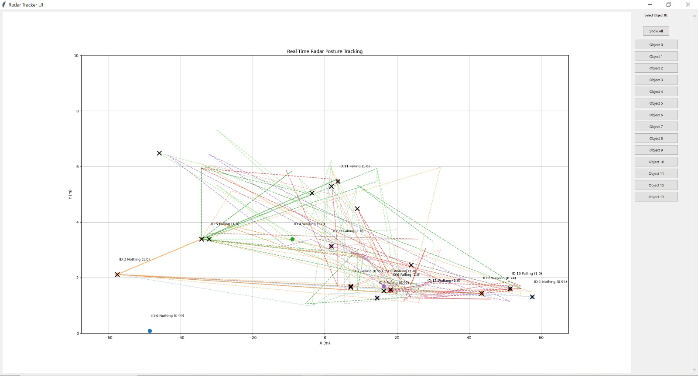
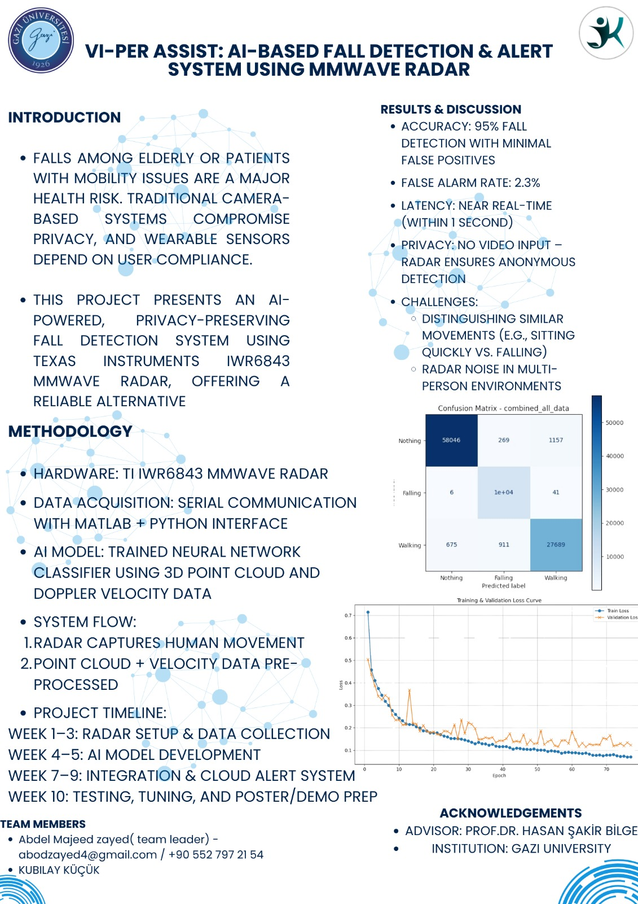

# 🧠 Radar-Based Posture Detection & Fall Tracking System

This project is a real-time radar-based posture tracking and fall detection system with cloud integration via MQTT. It visualizes human motion data using a live GUI, detects potential falls using clustering heuristics, and sends alerts to [ThingsBoard](https://demo.thingsboard.io/) for IoT visualization.

---

## 📦 Features

- 📡 **Real-time posture tracking** via TCP data stream  
- 🎯 **Fall detection** using spatial clustering  
- 🧭 **Track visualization** with Matplotlib + Tkinter  
- ☁️ **Cloud sync** with ThingsBoard over MQTT  
- 🧪 **Confidence-based filtering** and labeling  
- 🔍 **ID-based object filtering** in the GUI

---

## 🖥️ Interface



---

---

## 🖼️ Graduation Poster

You can view our official graduation poster here:



This poster was presented during the senior project exhibition and provides a visual summary of the project goals, methods, and results.


---

## 🗂️ File Structure

```
.
├── receiver.py              # Local TCP-based visualization
├── receiver_cloud.py        # Enhanced version with MQTT cloud push
├── sender.py                # Real-time sender script (sends JSON data)
├── sender_cloud.py          # Enhanced version with MQTT cloud push
├── utils/                   # Optional helper scripts (e.g. label.py)
├── assets/                  # Screenshots, icons, UI assets
├── requirements.txt
└── README.md
```

---

## 🚀 Quick Start

### ✅ 1. Clone the repository

```bash
git clone https://github.com/yourusername/radar-fall-tracker.git
cd radar-fall-tracker
```

### ✅ 2. Install dependencies

```bash
pip install -r requirements.txt
```

### ✅ 3. Run receiver with cloud integration

```bash
python receiver_cloud.py
```

Or for offline/local only visualization:

```bash
python receiver.py
```

### ✅ 4. Run the sender

```bash
python sender.py
```

> 🔁 The receiver waits for the sender to establish a TCP connection and stream radar posture data.

---

## 📊 Input Data Format

The radar provides CSV-formatted data per frame, which is parsed and streamed as JSON objects over TCP. Example:

```csv
Frame,Timestamp,ObjectID,X(m),Y(m),Z(m),Vx(m/s),Vy(m/s),Vz(m/s),Vr(m/s),range_sc(m),azimuth_sc(rad),azimuth_sc(deg),Posture
1,0.200,1,-45.951,0.085,1.000,0.000,0.000,0.000,0.000,45.962,3.13975,179.89,Standing
2,0.300,2,48.590,1.398,1.000,0.000,0.000,0.000,0.000,48.621,0.02876,1.65,Standing
```

Each object is described by:

- `ObjectID`: Unique target ID
- `X,Y,Z`: Position in meters
- `Vx,Vy,Vz, Vr`: Velocity components
- `range_sc`, `azimuth_sc`: Radar-specific tracking data
- `Posture`: Classification (can be Standing, Sitting, Falling, etc.)

---

## 📡 MQTT & ThingsBoard

This system publishes fall alerts and movement tracking to the ThingsBoard cloud via MQTT.

- Server: `demo.thingsboard.io`
- Topic: `v1/devices/me/telemetry`
- Token: *(stored in the script or via `.env`)*

---

---

## 🧠 Fall Detection Logic

- Consecutive fall points that occur within **0.5 meters** are grouped.
- When a group has more than **4 points**, it triggers a fall.
- These points are marked on the GUI and published to the cloud.

---

## 📌 Notes

- Ensure Python supports Tkinter in your environment.
- Replace MQTT broker/token as needed in the script.
- CSV to JSON transformation is assumed in sender logic.


## 📈 Performance Metrics

- ✅ **Accuracy:** 95.0%  
- 🚨 **False Alarm Rate:** 2.3%  

These metrics are based on validation experiments using real radar movement data, evaluated against manually labeled ground truth.

---

## 🙌 Acknowledgements

Developed as a graduation project by **Kubilay Küçük** and **Abdel Majeed**.  
Special thanks to our advisor **Prof. Dr. Hasan Şakir Bilge** for his invaluable guidance and support.

---

Supervised by Gazi University - Faculty of Engineering.

---

## 📄 License

This project is licensed under the MIT License.
